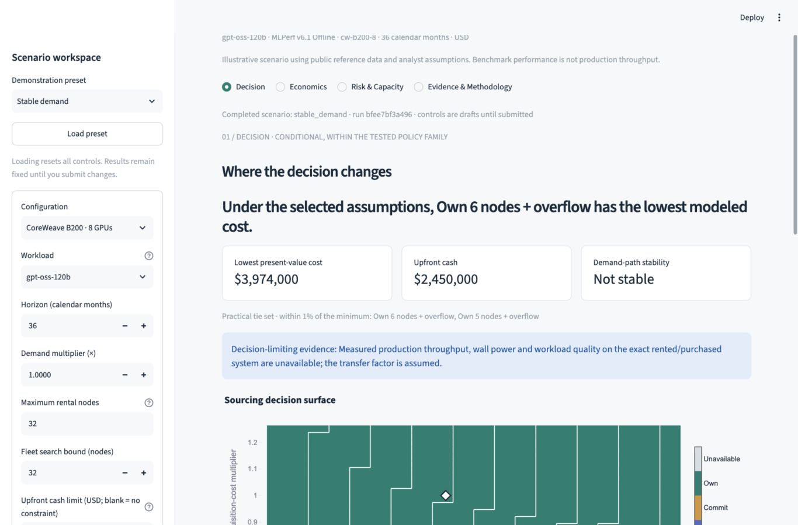

# AI Compute Economics & Capacity Model

**Live app:** [Launch the AI Compute Economics & Capacity Model](https://ai-compute-economics-ln4kzm3c2kn74qbpntdomz.streamlit.app)

**When should a batch-inference workload rent capacity, commit to a baseline, or own a fleet—and what would change that decision?**

This project compares the modeled cost and service feasibility of three sourcing policies over a common demand path. GPU-hour price alone misses throughput compatibility, whole-node billing, idle capacity, delivery delays, cash timing, power and overflow. A lower posted rate can still produce a higher total cost or fail to serve the workload.

| Policy | How demand is served |
|---|---|
| All on-demand | Whole rental nodes, subject to billing and availability limits |
| Committed baseline + overflow | Fixed take-or-pay nodes, with on-demand overflow |
| Owned baseline + overflow | Fixed purchased nodes after commissioning, with on-demand overflow |

The main output is a **decision frontier**, not a hardware recommendation: the lowest modeled cost under selected assumptions, practical ties, demand/utilization and acquisition/commitment-price switch brackets, tested reversals, and missing evidence. Cash flows, capacity, sensitivities and provenance explain the result.



## A reproducible worked example

**Illustrative scenario using public reference data and analyst assumptions—not a procurement recommendation.** The supplied 36-month `stable_demand` scenario selects **6 owned B200 nodes plus overflow**, with approximately **$3,974,000 present-value cost** and **$2,450,000 upfront cash**. Five owned nodes are also within the 1% practical tie set. A preferred-fleet switch occurs in the tested **0.95–1.00× demand bracket** (5 → 6 nodes); the result is not stable across all three tested demand paths. These are adjacent tested points, not an interpolated exact breakeven.

Reproduce this finding from [the scenario](scenarios/stable_demand.json), [generated memo](examples/decision_memo.md), and [full-precision results](examples/results.json). The default run hash begins `bfee7bf3a496`.

The primary workload is **gpt-oss-120b / MLPerf Inference v6.1 / Offline**. Frozen CoreWeave B200/B300 submissions report 91,487.4 / 112,840 output tokens/s for their respective complete benchmark nodes. **These are public observations, not production throughput measured by this project.** The model separately applies assumed transfer factors and availability. Exact workload, quality, runtime, topology and configuration matching remain mandatory. Llama 2 70B 99.9 Offline is a secondary historical reference.

Evidence is labeled **observed**, **derived**, **analyst assumption**, **user assumption**, or **unavailable**. For example, the B200 public node-hour price is observed; $400,000 acquisition cost and $40/node-hour commitment price are hypothetical defaults. B300 pricing remains unavailable unless the user provides a labeled assumption with a rationale. Missing inputs never become zero or inherit another GPU's price.

## Install and run

Use Python **3.12** and [uv](https://docs.astral.sh/uv/getting-started/installation/). Run commands from the repository root. Installation may need the network; application and analytical runs do not after installation.

```sh
uv sync --locked --python 3.12
uv run --offline compute-economics validate-data
uv run --offline streamlit run app.py --server.address 127.0.0.1
```

Open the local URL printed by Streamlit; stop with `Ctrl+C`. No API key, GPU, paid service, database server or provider login is required. The initial full frontier calculation shows a progress indicator. Controls are drafts until submitted, and invalid edits retain the last valid result.

The four views are **Decision**, **Economics**, **Risk & Capacity**, and **Evidence & Methodology**. Advanced assumptions use expanders; custom demand blocks and remaining validated settings are accessible through the advanced JSON editor. Downloads include versioned scenario JSON, a Markdown memo, complete CSV ledgers, provenance, and a ZIP bundle. User scenarios remain session-local. Only the public catalog is globally cached.

## Reproduce and validate

```sh
mkdir -p artifacts
uv run --offline compute-economics catalog --output artifacts/catalog.duckdb
uv run --offline compute-economics run scenarios/stable_demand.json --output artifacts/stable
uv run --offline compute-economics run artifacts/stable/scenario.json --output artifacts/replayed
uv run --offline python scripts/verify_reproduction.py
uv run --offline ruff check .
uv run --offline ruff format --check .
uv run --offline pytest -q
```

The reproduction script verifies all exported files for **all three presets**, then replays their exported JSON. Only the declared export-creation timestamp is excluded from envelope comparison. It blocks network connections. AppTest also checks all four views with outbound sockets disabled. All presets use the same frozen September 27, 2026 evidence.

[Validation](docs/validation.md) records actual tests, fresh-environment commands, performance measurements and their limits. CI runs the same checks; no remote CI run or deployment is claimed.

## Architecture and repository

```text
CSV/JSON snapshot → validation → DuckDB catalog
                             → immutable demand → whole-node capacity
                             → Python cash-flow / policy / risk engine
                             → reports and CLI → Streamlit + Plotly
```

The UI consumes engine outputs; it does not implement a second financial model. DuckDB performs source joins, evidence-coverage queries and annual aggregation. Strict Pydantic contracts reject invalid inputs. The lockfile fixes the tested dependencies.

```text
app.py                         Streamlit entry point
src/compute_economics/         Analytical engine, SQL, reporting, CLI and ui/
data/                          Curated tables and checksummed frozen evidence
scenarios/                     Stable, disappointing and delayed-capacity demand presets
examples/                      Reproducible exports for all three presets
scripts/                       Reproduction and review checks
tests/                        Numerical fixtures, source/engine tests and AppTest
docs/                         Methodology, provenance, validation and screenshots
```

## Limits and evidence still needed

This is batch inference only: no latency-SLO sizing, backlog, mixed-fleet dispatch, training, tax/debt model, live inventory, demand forecasting or purchasing integration. Deterministic downside/base/upside paths are tests, not probabilities. The comparison searches a disclosed finite policy family.

Production throughput transfer, wall power, actual demand, acquisition/colocation/commitment quotes, delivery, rental capacity, usable life and resale value need validation. No independently audited matching ownership-versus-rental study validates the complete TCO model. Benchmark hardware is not automatically equivalent to a rented or purchased system. Historical source values are not current offers.

## Review map and license

- [Methodology](docs/methodology.md): economic boundaries, formulas and frontier semantics.
- [Data dictionary](docs/data_dictionary.md): inputs, units, tables and exports.
- [Source collection](docs/source_collection.md): pinned benchmarks, provenance and refresh process.
- [Assumptions](docs/assumptions.md): defaults, sensitivity bounds and missing evidence.
- [Validation](docs/validation.md): numerical tests, reproducibility and measured performance.
- [Decisions](docs/decisions.md): scope choices and remaining issues.
- [Local operation and deployment readiness](docs/deployment.md).

Original code is [MIT licensed](LICENSE). Third-party evidence retains its own terms: see [THIRD_PARTY_NOTICES](THIRD_PARTY_NOTICES.md). This project does not claim provider, employer or client endorsement. Publication and deployment require separate approval.
